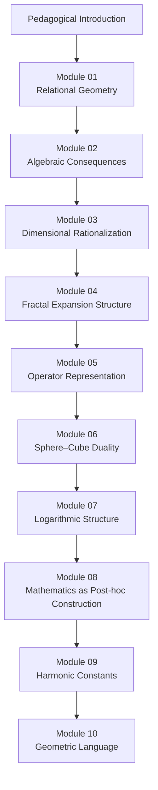

```text
# Vesica Meta – ASCII Index

📁 Vesica_Piscis_Meta_Modules_Construction
│
├── 📁 Module_00_Pedagogical_Introduction
│   └── README.md
│
├── 📁 Module_01_Relational_Geometry
│   └── README.md
│
├── 📁 Module_02_Algebraic_Consequences
│   └── README.md
│
├── 📁 Module_03_Dimensional_Rationalization
│   └── README.md
│
├── 📁 Module_04_Fractal_Expansion_Structure
│   └── README.md
│
├── 📁 Module_05_Operator_Representation
│   └── README.md
│
├── 📁 Module_06_Sphere_Cube_Duality
│   └── README.md
│
├── 📁 Module_07_Logarithmic_Structure
│   └── README.md
│
├── 📁 Module_08_Mathematics_as_Posthoc_Construction
│   └── README.md
│
├── 📁 Module_09_Harmonic_Constants
│   └── README.md
│
├── 📁 Module_10_Geometric_Language
│   └── README.md
│
└── 📁 Module_xXx_(unsorted_material)
    └── Appendix/
---
```

---

### **Mermaid Index**

```mermaid
flowchart TD

    A[Pedagogical Introduction] --> B01[Module 01<br/>Relational Geometry]
    A --> B02[Module 02<br/>Algebraic Consequences]
    A --> B03[Module 03<br/>Dimensional Rationalization]
    A --> B04[Module 04<br/>Fractal Expansion Structure]
    A --> B05[Module 05<br/>Operator Representation]
    A --> B06[Module 06<br/>Sphere–Cube Duality]
    A --> B07[Module 07<br/>Logarithmic Structure]
    A --> B08[Module 08<br/>Mathematics as Post-hoc Construction]
    A --> B09[Module 09<br/>Harmonic Constants]
    A --> B10[Module 10<br/>Geometric Language]

    click B01 "#Module_01_Relational_Geometry"
    click B02 "#Module_02_Algebraic_Consequences"
    click B03 "#Module_03_Dimensional_Rationalization"
    click B04 "#Module_04_Fractal_Expansion_Structure"
    click B05 "#Module_05_Operator_Representation"
    click B06 "#Module_06_Sphere_Cube_Duality"
    click B07 "#Module_07_Logarithmic_Structure"
    click B08 "#Module_08_Mathematics_as_Posthoc_Construction"
    click B09 "#Module_09_Harmonic_Constants"
    click B10 "#Module_10_Geometric_Language"
```



---

