---

# ✅ **APPENDIX H.1 — ASCII (Module 01: Relational Geometry)**

```text
RP9 — Module 01: Relational Geometry
===================================

Point
  ↓
Polarity
  ↓
Triad
  ↓
Hexagon
  ↓
Vesica (M1)
  ↓
Relation (Δ = √3)
  ↓
Linear Phase (r)
  ↓
Diagonal Phase (√2 r)
  ↓
Vertical Phase (√3 r)
  ↓
Phase Order
  → Linear → Circular → Spiral
  ↓
Dimensional Chain
  → 1D → 2D → 3D
  ↓
Feedback
  → Relation as constant
```

**Explanation:**  
This ASCII schema expresses _only the function of Module 01_:  
how the Vesica generates **relation**, **the three linear axes**, and how this creates **dimension and phase structure**.

---

# **APPENDIX M.1 — Mermaid (Module 01: Relational Geometry)**

```mermaid
flowchart TD

%% RP9 Module 01 — Relational Geometry

subgraph M01[Module 01 — Relational Geometry]
    A0[Point]
    A1[Polarity]
    A2[Triad]
    A3[Hexagon]
    A4[Vesica Piscis]
    A5[Relation Δ = √3]
    A6[Linear axis r]
    A7[Diagonal axis √2 r]
    A8[Vertical axis √3 r]
    A9[Dimensional triad<br/>1D → 2D → 3D]
end

A0 --> A1 --> A2 --> A3 --> A4 --> A5
A5 --> A6
A5 --> A7
A5 --> A8
A8 --> A9
```



---
---
---
---
