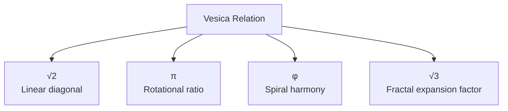

---

# **VM-02 — Algebraic Consequences (Module 2)**

This document describes the algebraic relations that arise as a direct consequence of the Vesica Piscis and its internal proportions. All values are derived from geometry, not arithmetic.

---

## **2.1 Irrational Relations Generated by the Vesica**

The Vesica Piscis produces irrational proportions as pure relational forms:

$$  
\sqrt{3}, \quad  
\frac{\sqrt{3}}{2}, \quad  
\frac{2}{\sqrt{3}}, \quad  
\sqrt{\frac{4}{3}}, \quad  
\ldots  
$$

These are:

- relational emergences
    
- scale-independent
    
- irreducible
    
- identical across all dimensional scales
    

**Proposition:**  
Irrational numbers are representations of Vesica relations, not their cause.

---

## **2.2 Three Primary Constants from the Vesica**

From the Vesica’s three linear expressions arise:

$$  
(\sqrt{2},; \pi,; \varphi)  
$$

where:

- **Linear diagonal:**  
    $$\sqrt{2}$$
    
- **Rotational perimeter (the circle’s relation):**  
    $$\pi$$
    
- **Spiral expansion ratio:**  
    $$\varphi$$
    

All three are secondary consequences of the Vesica’s mandorla and arise only _after_ the relational structure—never before.

---

## **2.3 Algebraic Phase Triad**

The algebraic triad:

$$  
\sqrt{2},\quad \pi,\quad \varphi  
$$

corresponds to three phase layers:

- linear phase → $$\sqrt{2}$$
    
- circular phase → $$\pi$$
    
- spiral phase → $$\varphi$$
    

This triad follows directly from the Vesica’s internal angle and line ratios.

---

## **2.4 The Vesica’s Internal Expansion Invariant**

The Vesica Piscis generates the vertical relation:

$$  
L_v = \sqrt{3}, r  
$$

and the horizontal:

$$  
L_h = r  
$$

This creates the expansion ratio:

$$  
\psi = \frac{L_v}{L_h} = \sqrt{3}  
$$

**ψ** is therefore the Vesica’s fractal scaling invariant.

---

## **2.5 First Derivation of Circular Algebra (π)**

Circular relation arises when the line (2r) is rotated into a circumference:

$$  
\frac{2\pi r}{2r} = \pi  
$$

This is a **pure relational consequence**, not a postulated constant.

---

## **2.6 Spiral Harmony (φ)**

The spiral’s expansion ratio arises as the relationship between:

- outward curvature
    
- inward curvature
    

yielding:

$$  
\varphi = \frac{1 + \sqrt{5}}{2}  
$$

This ratio is the algebraic expression of the spiral, but its cause lies in the Vesica’s asymmetric circular overlap.

---

## **2.7 Constants from the Vesica — Overview Table**

|Function|Constant|Origin|
|---|---|---|
|1D diagonal|$$\sqrt{2}$$|Square diagonal|
|2D circular rotation|$$\pi$$|Line–rotation relation|
|3D spiral harmony|$$\varphi$$|Curvature ratio|
|Vesica expansion invariant|$$\sqrt{3}$$|Vertical/horizontal relation|

---

## **2.8 Mermaid Diagram (Relational Logic)**

---

## **2.9 Module Anchor**

Belongs to: **Module 2 — Algebraic Consequences**

Function:  
This is where all algebraic values are defined as **necessarily arising** from the Vesica’s internal geometry. The document contains no invented values—only relations.

---

## **2.10 Domain Schema for Vesica Algebra**

All algebraic constants arise in three domains:

- Linear domain (1D):  
    $$  
    \sqrt{2}  
    $$
    
- Planar domain (2D):  
    $$  
    \pi  
    $$
    
- Volumetric domain (3D):  
    $$  
    \varphi  
    $$
    

The Vesica’s internal phase:  
$$  
\psi = \sqrt{3}  
$$

binds these three domains through multiplicative fractal expansion.

This creates the sequence:  
$$  
\sqrt{2} ;\rightarrow; \pi ;\rightarrow; \varphi  
$$  
which is exactly the same progression as:  
$$  
1D ;\rightarrow; 2D ;\rightarrow; 3D  
$$

---

## **2.11 The Vesica’s Invariant Chain**

Three algebraic ratios are invariant under all Vesica projections:

$$  
\frac{\sqrt{2}}{\sqrt{3}}, \qquad  
\frac{\pi}{\sqrt{2}}, \qquad  
\frac{\varphi}{\pi}  
$$

These express stepwise phase relationships in the transition:

$$  
1D \rightarrow 2D \rightarrow 3D  
$$

Additionally, the Vesica’s expansion dyad holds:  
$$  
\psi^2 = (\sqrt{3})^2 = 3  
$$

which is the internal metric governing all fractal RP9 operations.

---

## **2.12 Relation to Module 1 — Necessary Connection**

All algebraic constants in this module are secondary expressions of the three  
linear Vesica relations defined in Module 1:

- horizontal: $r$
    
- vertical: $\sqrt{3},r$
    
- diagonal: $r$ (internal symmetry)
    

Thus:

- $\sqrt{2}$ → algebraic expression of the diagonal
    
- $\pi$ → circular projection of $2r$
    
- $\varphi$ → spiral projection of $\pi$
    
- $\sqrt{3}$ → Vesica expansion factor
    

No constant is chosen — all are directly derived.

This is **functionally mandatory** in the RP9 system.

---

## **2.13 Why Algebra Arises (RP9 Algebra Axiom)**

RP9 defines algebra as:

$$  
\text{Algebra} = \Pi(\text{geometric asymmetry})  
$$

where the projection is based on the Vesica’s internal ratio:

$$  
\Delta = \frac{\sqrt{3}r}{r} = \sqrt{3}  
$$

This means:

- algebra is **born** from asymmetry
    
- all algebraic numbers are **projections**, not abstract objects
    
- irrational numbers are **relational emergences**, not primitive values
    

Algebra is therefore not a system invented by humans —  
it is the form the Vesica forces us to express.

---

## **2.14 The Triad Projection as an Algebraic Operator**

RP9’s algebraic chain:

$$  
\sqrt{2} ;\rightarrow; \pi ;\rightarrow; \varphi  
$$

is not three separate constants.  
It is an **operator sequence** driven by the Vesica’s dynamics:

$$  
\mathcal{O}_{\text{triad}}(x) = \psi \cdot x  
$$

where:

- first step $(\sqrt{2})$ = emergence of the diagonal
    
- second step $(\pi)$ = rotation of the diagonal
    
- third step $(\varphi)$ = spiral expansion of rotation
    

The algebraic triad is therefore:

$$  
\text{linear} \rightarrow \text{circular} \rightarrow \text{spiral}  
$$

---

## **2.15 ψ as an Algebraic Stabilizer**

The Vesica provides the expansion ratio:

$$  
\psi = \sqrt{3}  
$$

RP9 defines ψ as:

$$  
\psi = \text{algebraic stability between phases}  
$$

This means:

- ψ binds $\sqrt{2}$, $\pi$, and $\varphi$
    
- ψ determines when an algebraic relation is **stable** and recursive
    
- ψ is the fractal metric that ensures the triad continues
    

Formally:

$$  
\frac{\pi}{\sqrt{2}} \rightarrow \psi \rightarrow \frac{\varphi}{\pi}  
$$

ψ is therefore **the engine** of the algebraic dimensional transition.

---

## **2.16 GS–Alg Axiom (Final Axiom for Module 02)**

RP9’s algebraic axiom:

$$  
\text{Algebra} =  
\Pi_{\psi}  
\left(  
\mathrm{Rot}_{\theta}  
\left(  
\Delta \cdot r  
\right)  
\right)  
$$

where:

- $\Delta = \sqrt{3}$ = asymmetry ratio
    
- $\theta = 90^\circ$ = rotational cross for circular projection
    
- $\Pi_{\psi}$ = stabilizing projection
    

This binds together:

- $\sqrt{2}$ (diagonal)
    
- $\pi$ (rotation)
    
- $\varphi$ (spiral)
    
- $\psi$ (expansion)
    

**Algebra is the Vesica’s relational expression in numerical form.**

---

## **2.17 Axiom 01 — Condition for the Vesica’s Existence**

RP9 defines the Vesica Piscis as:

$$  
d = r  
$$

This is not a coincidence, but the **minimal possible non-identical state**  
between two identical entities.

This state immediately generates:

- asymmetry
    
- relation
    
- structure
    

The axiom states:

$$  
\text{Relation arises only when two identical magnitudes are separated by their own value.}  
$$

---

## **2.18 The Vesica as a Relational Operator**

The Vesica is not a figure but an operator:

$$  
\mathcal{V}(r) = {L_h,;L_v,;L_d}  
$$

where:

- horizontal line:  
    $$L_h = r$$
    
- vertical line:  
    $$L_v = \sqrt{3}r$$
    
- diagonal line:  
    $$L_d = 2r$$
    

RP9 defines the Vesica as:

$$  
\mathcal{V} = \text{the operator that produces relation}  
$$

Not “an image of two circles” — but **the first functional relation in geometry**.

---

## **2.19 The Three Linear Relations → Three Phase Layers**

Each line in the Vesica creates a phase:

|Line|Expression|Phase|
|---|---|---|
|horizontal|$r$|linear phase|
|diagonal|$\sqrt{2},r$ or $2r$|circular phase|
|vertical|$\sqrt{3},r$|spiral / expansive phase|

This is RP9’s fundamental triad:

$$  
\text{linear} \rightarrow \text{circular} \rightarrow \text{spiral}  
$$

All subsequent geometry follows this order.

---

## **2.20 Dimensional Triad: r → √3r → 2r**

The Vesica’s three radii describe three dimensional states:

1. **Line (1D):**  
    $$r$$
    
2. **Height axis / triad (2D):**  
    $$\sqrt{3}r$$
    
3. **Base for 3D projection:**  
    $$2r$$
    

The formal projection:

$$  
r \rightarrow \sqrt{3}r \rightarrow 2r  
$$

This is RP9’s first **dimensional ascent chain**.

---

## **2.21 GS–Rel Axiom (Final Axiom for Module 01 → Incorporated in Module 02)**

RP9’s fundamental relational axiom:

$$  
\text{Relation} =  
\frac{L_v}{L_h}  
$$

and since:

$$  
\frac{L_v}{L_h} = \sqrt{3}  
$$

it follows that:

$$  
\text{Relation} = \sqrt{3}  
$$

This means:

- relation is a ratio
    
- the ratio is constant
    
- the constant is the Vesica’s vertical/horizontal asymmetry
    

Relation is therefore **the first geometric quantity that exists prior to form**.

---

## **2.22 √π as the Transition Term Between Circular and Spiral Algebra**

Module 02 mentions π and φ as phase 2 and phase 3, but lacks the  
**intermediate term** that binds them in the RP9 system:

$$  
\sqrt{\pi}  
$$

RP9 defines this as:

$$  
\sqrt{\pi} = \text{circular–spiral transition factor}  
$$

It arises when:

- π (pure rotation)
    
- φ (spiral expansion)
    

must be connected without field collapse.

Functionally, this is the RP9 condition:

$$  
\sqrt{\pi} = \Pi_{\text{stable}}(\pi \rightarrow \varphi)  
$$

This means:

- π cannot expand directly into φ
    
- the Vesica requires an intermediate ratio
    
- this intermediate ratio is always $\sqrt{\pi}$
    

The algebraic transition sequence therefore becomes:

$$  
\sqrt{2} ;\rightarrow; \pi ;\rightarrow; \sqrt{\pi} ;\rightarrow; \varphi  
$$

---
---
---
