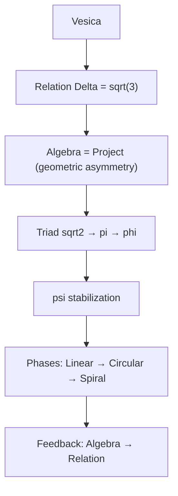

---

# **APPENDIX H.2 — ASCII (Module 02: Algebraic Consequences)**

```text
RP9 — Module 02: Algebraic Consequences
======================================

Point
  ↓
Polarity
  ↓
Triad
  ↓
Hexagon
  ↓
Vesica
  ↓
Relation (Δ = √3)
  ↓
Algebraic Projection
  → Algebra = Π(geometric asymmetry)
  ↓
Triadic Operator Sequence
  → √2 → π → φ
  ↓
ψ-stabilization (ψ = √3)
  ↓
Algebraic Phases
  → Linear → Circular → Spiral
  ↓
Algebraic Chain
  r → √2 r → π r → φ r
  ↓
Feedback
  → Algebra returns to relation (Δ)
```

**What this ASCII shows:**  
Module 02 explains _why algebra arises_, how it is _projected from asymmetry_, and how √2 → π → φ form an **operator triad** stabilized by ψ.

---

# ✅ **APPENDIX M.2 — Mermaid (Module 02: Algebraic Consequences)**



---
---
---
---