---

# **APPENDIX H.2 — ASCII (Module 02: Algebraic Consequences)**

```text
RP9 — Module 02: Algebraic Consequences
======================================

Point
  ↓
Polarity
  ↓
Triad
  ↓
Hexagon
  ↓
Vesica
  ↓
Relation (Δ = √3)
  ↓
Algebraic Projection
  → Algebra = Π(geometric asymmetry)
  ↓
Triadic Operator Sequence
  → √2 → π → φ
  ↓
ψ-stabilization (ψ = √3)
  ↓
Algebraic Phases
  → Linear → Circular → Spiral
  ↓
Algebraic Chain
  r → √2 r → π r → φ r
  ↓
Feedback
  → Algebra returns to relation (Δ)
```

**What this ASCII shows:**  
Module 02 explains _why algebra arises_, how it is _projected from asymmetry_, and how √2 → π → φ form an **operator triad** stabilized by ψ.

---

# ✅ **APPENDIX M.2 — Mermaid (Module 02: Algebraic Consequences)**

```mermaid
flowchart TD

B0["Vesica"]
B1["Relation Delta = sqrt(3)"]
B2["Algebra = Project (geometric asymmetry)"]
B3["Triad sqrt2 → pi → phi"]
B4["psi stabilization"]
B5["Phases: Linear → Circular → Spiral"]
B6["Feedback: Algebra → Relation"]

B0 --> B1 --> B2 --> B3 --> B4 --> B5 --> B6
```



---
---
---
---