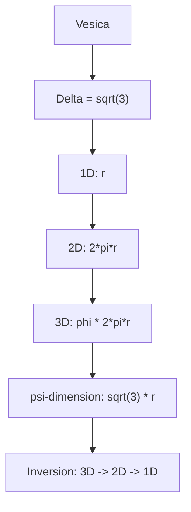

---

# ✅ **APPENDIX H.3 — ASCII**

### **What we render & why:**

Module 03 concerns the **emergence of dimension** in RP9.  
Therefore, the ASCII diagram should visualize:

- how the Vesica produces 1D → 2D → 3D
    
- how ψ (sqrt(3)) triggers ascent
    
- how dimensions collapse back (inversion)
    
- how each step is a function of Δ (the relation)
    

This diagram therefore shows the entire **dimensional life cycle** according to RP9.

```text
RP9 — Module 03: Dimensional Rationalization
===========================================

Point
  ↓
Polarity
  ↓
Triad
  ↓
Hexagon
  ↓
Vesica
  ↓
Root cause of dimension (Δ = √3)
  ↓
1D — Line (r)
  ↓
2D — Circular closure (2πr)
  ↓
3D — Spiral volume (φ·2πr)
  ↓
ψ-dimension — Vertical axis (√3 r)
  ↓
Dimensional inversion
  3D → 2D → 1D
  (Spiral → Circle → Line)
  ↓
Feedback to Vesica (constancy of relation)
```

---

# ✅ **APPENDIX M.3 — Mermaid**

### **What we render & why:**

The Mermaid diagram should show:

- the module’s internal structure in pure top-down form
    
- only the dimensional steps
    
- no extra nodes, no explanations — only _the structure itself_
    
- labels in `"` to avoid all parsing errors
    
- the graph represents exactly RP9’s 1D → 2D → 3D → ψ → inversion
    

This is the **visual core** of Module 03.



---
---
---
---
