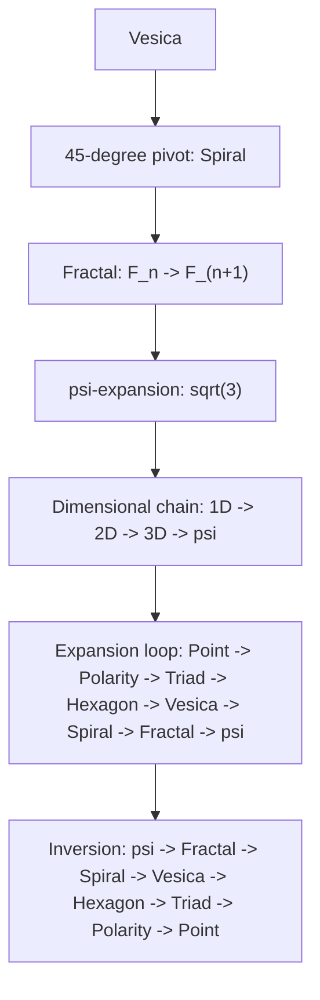

---

# **APPENDIX H.4 — ASCII (Module 04: Fractal Expansion Structure)**

## **What We Render & Why**

Module 04 describes RP9’s:

- **fractal expansion chain**
    
- **ψ-driven ascension**
    
- **the 45° pivot as a dimensional motor**
    
- **recursion (Fₙ → Fₙ₊₁)**
    
- **the expansion axiom**
    

The diagram therefore visualizes:

- the entire phase chain Point → Spiral → Fractal → ψ
    
- how the Vesica generates expansion
    
- how expansion proceeds from 1D → 2D → 3D → ψ
    
- how the fractal feeds back
    
- the internal return (inversion)
    

This is **the heart of Module 04**.

---

## **ASCII — Module 04**

```text
RP9 — Module 04: Fractal Expansion Structure
============================================

Point
  ↓
Polarity
  ↓
Triad
  ↓
Hexagon
  ↓
Vesica
  ↓
Spiral (45° pivot)
  ↓
Fractal (recursion F_n → F_(n+1))
  ↓
ψ-expansion (sqrt(3))
  ↓
Dimensional transition (1D → 2D → 3D → ψ)
  ↓
Expansion chain
  → point → polarity → triad → hexagon → vesica → spiral → fractal → ψ
  ↓
Feedback / Inversion
  → ψ → fractal → spiral → vesica → hexagon → triad → polarity → point
```

---

# **APPENDIX M.4 — Mermaid (Module 04)**

## **What We Render & Why**

The diagram is intended to show:

- the **structure of the fractal expansion chain**
    
- the **ψ-driven progression**
    
- the **45°-triggered spiral point**
    
- the **closed feedback cycle**
    

For maximum stability and 100% Obsidian compatibility, **all nodes are enclosed in `"`**.

---

## **Mermaid — Module 04**



---
---
---
---
