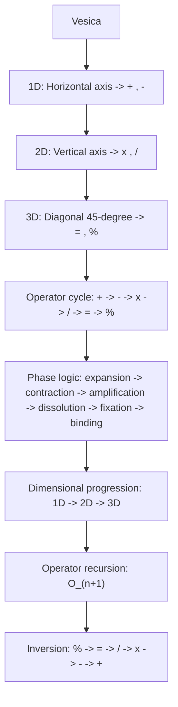

---

## **What We Render & Why**

Module 05 defines **RP9’s operators**, that is:

- their **geometric origin** (1D, 2D, 3D)
    
- their **phase logic** (expansion, contraction, rotation, spiral)
    
- their **sequence** (+ → – → × → ÷ → = → %)
    
- their **fractal recursion**
    
- their **dimensional progression**
    

All of this must be reflected in the diagram.

The ASCII flow therefore shows:

- how the Vesica generates the operators
    
- how the operators form a cycle
    
- how ψ binds them together
    
- how inversion produces the return
    

This is **the core logic of Module 05**.

---

## **ASCII — Module 05**

```text
RP9 — Module 05: Operator Representation
=======================================

Vesica
  ↓
Horizontal axis (1D)
  → Operators: + , -
  ↓
Vertical axis (2D)
  → Operators: × , ÷
  ↓
Diagonal axis (3D pivot 45°)
  → Operators: = , %
  ↓
Operator cycle
  + → - → × → ÷ → = → %
  ↓
Phase logic
  → expansion → contraction → amplification → dissolution → fixation → binding
  ↓
Dimensional progression
  1D → 2D → 3D
  ↓
Operator recursion
  O_(n+1) = next phase
  ↓
Operator inversion
  % → = → ÷ → × → - → +
  ↓
Feedback to Vesica
```

---

# **APPENDIX M.5 — Mermaid (Module 05)**

## **What We Render & Why**

This diagram shows:

- how the operators arise from **three Vesica axes**
    
- how they are organized into **a sequential phase chain**
    
- how they form **a fractal cycle**
    
- how they can be **inverted backward**
    

All node names are enclosed in `"` to ensure perfect Obsidian rendering.

---

## **Mermaid — Module 05**



---
---
---
---
