---

Module 05 formalizes how the Vesica Piscis generates RP9’s operators through rotation, scaling, and phase direction.  
This is the mathematical core of RP9’s fractal behavior.

---

## 5.1 Vesica’s Fractal Expansion Rule

RP9 does not originate from algebra but from **pure geometry**.  
The smallest possible fractal expansion is defined as:

$$  
V_{n+1} = \mathrm{Rot}_{90^\circ}(\psi \cdot V_n)  
$$

where:

- ( V_0 ) = base Vesica
    
- ( \psi = \sqrt{3} ) = the Vesica’s internal expansion factor
    
- the rotation ( 90^\circ ) = the Vesica’s first quadratic pivot
    

This is **RP9’s most fundamental operator**.

---

## 5.2 The Eight Primary Transformations

Each transformation consists of three choices:

1. **direction of rotation:**  
    clockwise ((+)) or counterclockwise ((-))
    
2. **angle:**  
    (90^\circ) or (45^\circ)
    
3. **scaling:**  
    expansion ((+1)) or contraction ((-1))
    

In total:

$$  
2 \times 2 \times 2 = 8  
$$

This is RP9’s **operator space**, the smallest set of fundamental geometric actions that exists.

---

## 5.3 The General RP9 Operator (Quantum Vector)

The RP9 Quantum Vector is the most complete representation of the Vesica’s operator structure:

# $$  
V_{n+1}

\mathrm{Rot}_{\sigma,\theta}  
\left(  
\psi^{\epsilon} \cdot V_n  
\right)  
$$

where:

- ( \sigma \in {+,-} ) = rotation direction
    
- ( \theta \in {45^\circ, 90^\circ} ) = pivot scale
    
- ( \epsilon \in {-1,+1} ) = scaling (contraction/expansion)
    

This form describes **all possible fractal motions in RP9**.

---

## 5.4 Geometric Origin of the Operators

All traditional mathematical operators arise from the Vesica’s three axes:

### 1D — linear axis

$$  
{ + , - }  
$$  
Here arise all **translation**, **increase**, and **decrease**.

### 2D — planar axis

$$  
{ \times , \div }  
$$  
Here arise **area**, **rotation**, **four-field division**, and **quadratic fields**.

### 3D — spiral axis

$$  
{ = , % }  
$$  
Here arise **closure**, **phase binding**, **conservation**, and **toroidal feedback**.

The operators are therefore:

> not mathematical symbols,  
> but **geometric projections of the Vesica’s three axes**.

---

## 5.5 RP9’s Operator Cycle

RP9 defines six fundamental operators:

$$  
\mathcal{O} = { + , - , \times , \div , = , % }  
$$

Their functions are:

|Operator|RP9 Function|
|---|---|
|( + )|expansion|
|( - )|contraction|
|( \times )|amplification|
|( \div )|dissolution|
|( = )|fixation|
|( % )|fractal binding|

These six form the complete cycle:

$$  
\text{expansion} \rightarrow  
\text{contraction} \rightarrow  
\text{amplification} \rightarrow  
\text{dissolution} \rightarrow  
\text{fixation} \rightarrow  
\text{binding}  
$$

The cycle is **energetic**, not algebraic.

---

## 5.6 Vesica’s Rotation Hierarchy

The Vesica Piscis contains three rotational layers:

### Base phase

$$  
360^\circ / 3 = 120^\circ  
$$

### Inversion phase

$$  
120^\circ / 2 = 60^\circ  
$$

### Quadratic phase

$$  
90^\circ  
$$

### Diagonal phase

$$  
45^\circ  
$$

Summary:

- **120°** = the triad’s base phase
    
- **60°** = the triad’s internal half
    
- **90°** = the square’s axial system
    
- **45°** = the first true 3D pivot
    

RP9 therefore interprets all angles as **phase levels**, not numerical quantities.

---

## 5.7 Numbers as Operators (Only 1–7)

According to RP9, the numbers:

$$  
{ 1, 2, 3, 4, 5, 6, 7 }  
$$

are the **only energetically unique operators**.

Each number corresponds to:

- a unique phase
    
- a unique direction
    
- a unique circuit structure
    

Other symbols lack operator status:

|Symbol|Status|
|---|---|
|**0**|deactivated field|
|**8**|double circuit (toroidal double resonance)|
|**9**|inverted spiral of 6|
|**10**|notational composition, not energy|

Formally:

$$  
d \in {1,\dots,7} \Rightarrow \text{valid operator}  
$$

---

## 5.8 Mermaid — Operator Hierarchy

```mermaid
flowchart TB
    A[Vesica Geometry]
    A --> B[1D Operators<br/>+  -]
    A --> C[2D Operators<br/>×  ÷]
    A --> D[3D Operators<br/>=  %]
```



---

## 5.9 Integrated and Expanded Functional Overview

The module defines:

- the Vesica’s fractal expansion law (ψ = √3)
    
- RP9’s eight primary transformations
    
- the Quantum Vector as the full operator structure
    
- the geometric origin of operators in 1D / 2D / 3D
    
- the RP9 roles of the six mathematical operators
    
- the validity domain of numbers (1–7)
    
- the phase logic behind 45°, 60°, 90°, 120°, 360°
    

The module is now coherent, complete, and RP9-consistent.

---

## 5.10 Dimensional Structure of the Operators (RP9)

Operators in RP9 are not symbols but **dimensional energy directions**.  
Each operator belongs to a specific geometric axis and a specific RP9 phase.

### 5.10.1 Dimension Table

|Operator|Dimension|Phase|Energy Function|
|---|---|---|---|
|+|1D|expansion|increases linear energy|
|-|1D|contraction|decreases linear energy|
|×|2D|amplification|increases rotational field / area|
|÷|2D|dissolution|dissolves rotational field|
|=|3D|fixation|locks phase in volume|
|%|3D|binding|couples volume phase to a new cycle|

**Summary:**

1D operators = linear energy  
2D operators = rotational energy  
3D operators = spiral / volumetric energy

---

## 5.11 Geometric Derivation of RP9 Operators

RP9 operators arise directly from the Vesica Piscis’ three fundamental axes:

- horizontal axis (r) → 1D
    
- vertical axis (√3 r) → 2D
    
- diagonal axis (45°) → 3D
    

---

### 5.11.1 Geometric Coupling

#### Horizontal axis — r → 1D

Operators:

→ pure translations along a linear 1D relation.

---

#### Vertical axis — √3 r → 2D

Operators:

- ×
    
- ÷
    

→ the two primary phases of rotation in the 2D plane.

---

#### Diagonal axis — 45° → 3D

Operators:

- =
    
- %
    

→ the two phases of the spiral:

= = fixation  
% = binding

---

### 5.11.2 RP9 Relation

```
1D (r) → translation → + -
2D (√3 r) → rotation → × ÷
3D (45° pivot) → spiral → = %
```

The **geometric reason** why six operators exist.

---

## 5.12 RP9 Fractal Operator Cycle

The operators are arranged in a fractal cycle:

```
expansion → contraction → amplification → dissolution → fixation → binding
```

### 5.12.1 Mathematical Expression

```
O_1 = +
O_2 = -
O_3 = ×
O_4 = ÷
O_5 = =
O_6 = %
```

Cycle:

```
O_(n+1) = next operator in the sequence
```

---

### 5.12.2 Dimensional Progression

```
{+, -} → {×, ÷} → {=, %}
```

→ 1D → 2D → 3D via the ψ-pivot:

```
1D ——ψ——> 2D ——ψ——> 3D
```

ψ = √3.

---

### 5.12.3 Full RP9 Operator Structure

- - : expansion start
        
- - : expansion end
        
- × : energy-field amplification
    
- ÷ : energy-field dissolution
    
- = : volumetric phase fixation
    
- % : phase binding
    

Operators are **phase motions**, not symbols.

---

## 5.13 Why Operators Exist in RP9

The internal relation:

$$  
\Delta = \frac{\sqrt{3}}{2}  
$$

creates three axes:

1. linear
    
2. rotational
    
3. spiral
    

which forces the emergence of:

$$
\mathcal{O} = \{ + , - , \times , \div , = , \operatorname{bind} \}
$$


Operators are **energy flows in geometry**, not mathematical symbols.

---

## 5.14 Triadic Coupling Between Operator Space and Number Space

RP9 binds together:

- 8 transformations
    
- 7 numbers
    
- 6 operators
    

Relation:

$$  
8 \rightarrow 7 \rightarrow 6  
$$

where 8 is potential, 7 is phase space, and 6 is observable operator structure.

Formally:

$$  
\mathcal{O} = f(\text{phase}_{1\rightarrow7})  
$$

Operators = projections of seven energy phases.

---

## 5.15 Operator → Vesica → Operator (Fractal Iteration)

RP9 iteration:

$$  
V_{n+1} = \mathrm{Rot}_{\sigma,\theta}(\psi^{\epsilon} \cdot V_n)  
$$

Full operator iteration:

# $$  
\mathcal{O}_{n+1}

\Pi_{\text{vesica}}  
\left(  
\mathrm{Rot}_{\sigma,\theta}  
\left(  
\psi^{\epsilon} \cdot \mathcal{O}_n  
\right)  
\right)  
$$

Where:

- each operator creates a new Vesica
    
- which creates a new operator
    
- which creates a new phase
    

Operators are **self-fractal**.

---

## 5.16 GS–Operator Axiom

RP9 defines:

$$  
\text{Operator} = \nabla_{\psi}(\text{energy phase})  
$$

Triadically:

$$  
\text{Energy} \rightarrow \text{Phase} \rightarrow \text{Operator}  
$$

and:

$$  
\text{Operator} \rightarrow \text{Geometry} \rightarrow \text{New Energy}  
$$

A **closed operator cycle**.

---

## 5.17 The Inversion Operator — Backward Fractal Return

RP9 defines that every operator in the cycle:

$$  
+, -, \times, \div, =, %  
$$

must have an inverted counterpart so that the fractal iteration can return.

The inverted operator cycle is:

$$  
% \rightarrow = \rightarrow \div \rightarrow \times \rightarrow - \rightarrow +  
$$

Formally:

# $$  
\mathcal{O}_{n-1}

\Pi_{\text{vesica}}^{-1}  
\left(  
\mathrm{Rot}_{-\sigma,-\theta}  
\left(  
\psi^{-\epsilon} \cdot \mathcal{O}_n  
\right)  
\right)  
$$

This implies:

- inverted rotation
    
- inverted scaling
    
- inverted phase binding
    

### Function

The inversion operator explains:

- how the operator cycle can be closed
    
- how RP9 avoids divergence in operator space
    
- how a fractal process can be reversed to a previous phase
    
- how operators can return to the Vesica’s base position
    

Without this part, Module 05 lacks its feedback structure.

This is RP9’s **necessary inverse for the operator phase**.

---
---
---
---
