---

Module 6 describes how the Vesica Piscis is projected from 2D → 3D and creates the structure that RP9 later uses as a phase node. All expressions in this document are derived directly from the Vesica’s three lines.

---

## **6.1 The Vesica as a Projection Node**

The Vesica Piscis is defined by two identical circles with:

$$  
d = r  
$$

The vertical relation:

$$  
L_v = \sqrt{3},r  
$$

creates the first **3D indicator** in the system.  
All later volumetric geometry is built upon this relation.

---

## **6.2 The Sphere**

The volume of the sphere with radius ( r ):

$$  
V_s = \frac{4}{3}\pi r^3  
$$

The sphere is the **volumetric expression of the circular phase** and functions as the Vesica’s extension into 3D.

---

## **6.3 The Cube**

The cube is the **3D projection of the linear phase**.  
If the Vesica’s radius corresponds to half the cube’s edge length, then:

$$  
V_c = (2r)^3 = 8 r^3  
$$

This yields an exact volume ratio:

$$  
\frac{V_c}{V_s} = \frac{8 r^3}{\frac{4}{3}\pi r^3}  
$$

$$  
\frac{V_c}{V_s} = \frac{6}{\pi}  
$$

This ratio is **purely geometric**, not algebraically defined.  
The Vesica is the projection source.

---

## **6.4 Sphere–Cube–Vesica as a Triple Structure**

The three forms are mapped according to the Vesica’s three primary lines:

|Primary line|Length|3D function|
|---|---|---|
|horizontal|( r )|cube edge|
|vertical|( \sqrt{3},r )|sphere diameter / cube diagonal axis|
|diagonal|( r ) or ( \sqrt{2},r )|quadratic rotation axis|

Relations:

$$  
\text{Square diagonal} = \sqrt{2},r  
$$

$$  
\text{Cube diagonal} = \sqrt{3},r  
$$

These are **strictly Vesica-derived**, not number-based.

---

## **6.5 The RP9 Node (ψ, π, φ) as a Phase Hub**

The Vesica generates three inherent measures:

1. **Diagonal relation:**  
    $$\sqrt{2}$$
    
2. **Circular relation:**  
    $$\pi$$
    
3. **Spiral relation:**  
    $$\varphi$$
    

These three create the phase space of the RP9 node.  
RP9 is not an independent construction —  
it is **the point where the Vesica’s three phases intersect**:

$$  
(\sqrt{3},\ \pi,\ \varphi)  
$$

RP9 functions as:

- phase node
    
- dimensional switch
    
- projection between 2D and 3D
    
- fractal regulator
    

None of this is “theory.”  
It is **the mathematics of projection**.

---

## **6.6 Inversion and the G9 Phase**

In RP9, a necessary inversion arises when the hexagon (6) transitions to the regulator point (7):

$$  
6 \rightarrow 7  
$$

Here:

- **6** = stable hexagonal phase
    
- **7** = inversion, asymmetric feedback
    
- **G9** = the gravitational phase as the expression of inversion
    

G9 is not a constant.  
It is the phase where symmetry is restored through asymmetry.

---

## **6.7 Point 7 as the System Regulator**

In the expansion chain:

$$  
1 \rightarrow 2 \rightarrow 3 \rightarrow 6 \rightarrow 7 \rightarrow 10  
$$

**7** is the reconnection point.

It represents:

- asymmetric stabilization
    
- energy retraction
    
- internal phase feedback
    
- the boundary between open and closed expansion
    

This is where RP9’s fractal stability is established.

---

## **6.8 From Vesica to Cube — the Projection Chain**

Projection steps:

1. Vesica
    
2. Triangle
    
3. Hexagon
    
4. Cube
    
5. Tesseract (4D cube)
    

Relations:

$$  
\text{Hexagon} = 6 \times \text{Triangle}  
$$

$$  
\text{Cube} = \text{Hexagon}^{3D}  
$$

$$  
\text{Tesseract} = \text{Cube}^{4D}  
$$

These steps are **mandatory consequences** of the Vesica’s internal geometry.

---

## **6.9 ASCII Projection (Simple Visualization)**

```
   Sphere (π)         Vesica (√3)         Cube (2r)
     ○                 ()               [■]
```

---

## **6.10 Mermaid Projection**

```mermaid
flowchart TB
    A["Vesica\nRelation node"]
    A --> B["Sphere\n4⁄3 · π · r³"]
    A --> C["Cube\n(2r)³"]
    B --> D["Volume ratio\n6⁄π"]
```



---

## **6.11 Module Anchor**

Module: **06 — Sphere–Cube Duality / RP9 Node**

Contains:

- 2D → 3D projection
    
- ψ-geometry
    
- sphere–cube relations
    
- RP9 as a phase node
    
- inversion and G9
    

This document is now **complete, consistent, Obsidian-friendly, and ready for use**.

---

## **6.12 Why Sphere–Cube Duality Exists**

RP9 defines two fundamental expansion forms:

1. **Linear expansion**  
    $$E_L = 2r$$  
    → projects the Vesica into a cube
    
2. **Circular expansion**  
    $$E_C = \pi r$$  
    → projects the Vesica into a sphere
    

The duality is unavoidable, because the Vesica contains only:

- a horizontal line (linear field)
    
- a circular arc (rotational field)
    

These two expansion paths are **RP9’s only possible 3D projections**.

---

## **6.13 2D → 3D → 4D as Triadic Projection**

RP9 expresses dimensional ascent via ψ:

$$  
\psi = \sqrt{3}  
$$

The dimensional projection is:

$$  
2D \xrightarrow{\psi} 3D \xrightarrow{\psi} 4D  
$$

which yields the chain:

$$  
\text{Vesica} \rightarrow \text{Hexagon} \rightarrow \text{Cube} \rightarrow \text{Tesseract}  
$$

This is not optional — it is the Vesica’s own recursion.

---

## **6.14 RP9’s 3D Field Triad**

The three 3D fields are:

|Field|Geometry|Function|
|---|---|---|
|linear|cube|stable expansion|
|circular|sphere|rotational field|
|spiral|RP9 node|iterative switching|

The triad’s formal expression:

$$  
(\text{cube},\ \text{sphere},\ \text{RP9})  
$$

This is RP9’s 3D structure.

---

## **6.15 ψ as a Dimension Trigger**

ψ arises from the Vesica’s vertical line:

$$  
L_v = \sqrt{3},r  
$$

RP9 defines:

$$  
\psi = \text{minimum for 3D projection}  
$$

Because ( \sqrt{3} ) is:

- the cube’s diagonal
    
- the sphere’s height axis
    
- the Vesica’s vertical projection
    

ψ is the **internal mechanism** that forces dimensional ascent.

---

## **6.16 GS–3D Axiom: 3D Is the Vesica’s Volume Projection**

RP9’s 3D axiom:

$$  
\text{3D} = \Pi_{\psi}(\text{Vesica})  
$$

where the projection is defined as:

$$  
\Pi_{\psi} : (r,\sqrt{2}r,\sqrt{3}r) \rightarrow (\text{cube},\text{sphere})  
$$

This means:

- the Vesica is the 2D cause
    
- ψ is the projection motor
    
- cube and sphere are the 3D effects
    

---

## **6.17 Inversion of 3D Projection (Cube/Sphere → Vesica)**

RP9 defines that every 3D projection must be invertible so that  
geometry can return to its original relational node.

The inversion follows the chain:

$$  
\text{Cube} \rightarrow \text{Hexagon} \rightarrow \text{Triangle} \rightarrow \text{Vesica}  
$$

and correspondingly for the sphere:

$$  
\text{Sphere} \rightarrow \text{Circle} \rightarrow \text{Diameter} \rightarrow \text{Vesica}  
$$

Formally expressed:

$$  
P_{n-1} =  
\Pi_{\psi}^{-1}  
\left(  
\mathrm{Rot}_{-45^\circ}  
\left(  
\psi^{-1} \cdot P_n  
\right)  
\right)  
$$

This implies three inverted operations:

1. negative scaling:  
    $$\psi^{-1} = \frac{1}{\sqrt{3}}$$
    
2. negative rotation:  
    $$-45^\circ$$
    
3. negative projection:  
    $$\Pi_{\psi}^{-1}$$
    

### Function

The inversion explains:

- how 3D forms can be restored to 2D
    
- how sphere and cube return to the same origin relation
    
- why the Vesica is the projection node for both ascent and return
    
- how 4D structures can be inverted back to a stable phase (the RP9 node)
    

Without this inversion, expansion is **open**, not closed —  
and RP9 requires a closed phase cycle.

This block completes Module 06.

---
---
---
---
,