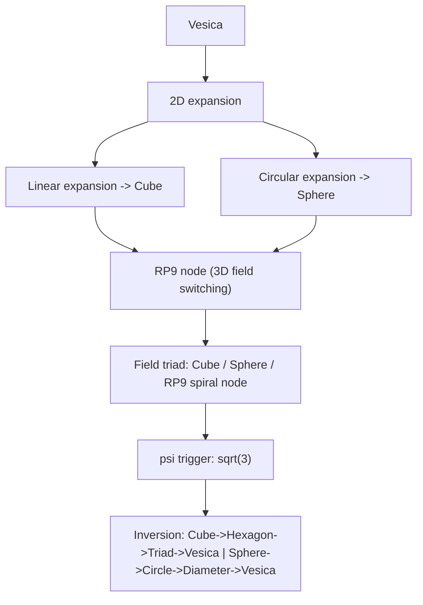

Below is a **complete, direct English translation** of the provided text.  
Structure, ordering, ASCII, and Mermaid are preserved; only language is translated.

---

## **What We Render & Why**

Module 06 describes:

- how the Vesica’s two expansion paths create **3D duality**
    
    - **linear expansion → Cube**
        
    - **circular expansion → Sphere**
        
- how ( \psi = \sqrt{3} ) triggers 3D projection
    
- how the RP9 node functions as a **switching point**
    
- how 3D → 2D → Vesica inversion works
    
- how the Cube, Sphere, and RP9 node form the 3D field triad
    

The ASCII diagram visualizes:

- 2D → 3D projection
    
- the dual path (cube / sphere)
    
- the ψ dimension
    
- the return to the Vesica
    

This **is the entire core of the module**.

---

## **ASCII — Module 06**

```text
RP9 — Module 06: Sphere–Cube Duality
===================================

Vesica
  ↓
2D expansion
  ↓
Linear expansion (2r)
  → Cube (3D)
  ↓
Circular expansion (π r)
  → Sphere (3D)
  ↓
RP9 node (switching point)
  ↓
3D field triad
  → Cube
  → Sphere
  → RP9 spiral node
  ↓
ψ-trigger for 3D
  (psi = sqrt(3))
  ↓
4D projection (theoretical tesseract path)
  ↓
Inversion
  Cube → Hexagon → Triad → Vesica
  Sphere → Circle → Diameter → Vesica
  ↓
Restoration of 2D geometry
```

---

# **APPENDIX M.6 — Mermaid (Module 06)**

## **What We Render & Why**

The Mermaid graph shows:

- the **dual projection**: Vesica → Cube / Vesica → Sphere
    
- ψ as the **dimension motor**
    
- the RP9 node as **3D switching**
    
- the **inversion** you added earlier
    

All labels are enclosed in `"` for full robustness in Obsidian.

---

## **Mermaid — Module 06**



---
---
---
---
