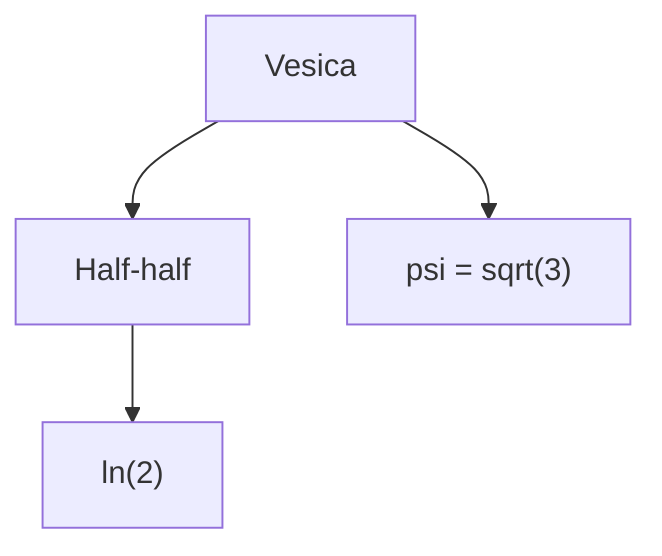

---

_Modul 7: ln(2), the half–half principle, RP9’s logarithmic network_

---

## 7.1 Fundamental principle: Why $\ln(2)$ emerges from the Vesica

Vesica Piscis is defined by the half–half relation:

$$  
d = r  
$$

Two identical radii create two identical halves that overlap.  
Logarithmically, this corresponds to **doubling/halving**, whose natural constant is:

$$  
\ln(2)  
$$

This is the **smallest logarithmic operation** that exists in RP9, because the Vesica only creates:

- two halves
    
- a division point
    
- a recursive doubling axis
    

---

## 7.2 Logarithmic coherence in the Vesica’s three lines

The Vesica consists of three fundamental lengths:

- horizontal:  
    $$L_h = r$$
    
- diagonal:  
    $$L_d = \sqrt{2},r$$
    
- vertical:  
    $$L_v = \sqrt{3},r$$
    

Their logarithmic counterparts are:

$$  
\ln(r) = \ln(1) = 0  
$$

$$  
\ln(\sqrt{2}) = \tfrac{1}{2}\ln(2)  
$$

$$  
\ln(\sqrt{3}) = \tfrac{1}{2}\ln(3)  
$$

These three expressions define the Vesica’s **logarithmic expansion field**:

- $0$ → identity (no expansion)
    
- $\tfrac{1}{2}\ln(2)$ → first true halving
    
- $\tfrac{1}{2}\ln(3)$ → the triad’s logarithmic expansion ratio
    

---

## 7.3 RP9 relation: $\psi$ and $\ln(2)$

The Vesica’s internal expansion constant:

$$  
\psi = \sqrt{3}  
$$

The Vesica’s logarithmic expansion constant:

$$  
\ln(2)  
$$

These two are **orthogonal functions**:

- $\psi$ governs **the geometry of triadic expansion**
    
- $\ln(2)$ governs **the logic of doubling**
    

Together they form RP9’s logarithmic network:

$$  
(\ln(2), \psi) \Rightarrow \text{stable fractal expansion}  
$$

---

## 7.4 Invariance of halving — logarithmic structure in RP9

RP9 is built on recursion in half–half operations:

- half
    
- half of a half
    
- half of a half of a half
    

The logarithmic representation is:

$$  
\ln(2),\quad \frac{1}{2}\ln(2),\quad \frac{1}{4}\ln(2),\dots  
$$

Each step corresponds to RP9’s rotational halvings:

- $180^\circ$
    
- $90^\circ$
    
- $45^\circ$
    

Half of a half of rotation and half of a half of a logarithm are  
**the same operation expressed in two domains**.

---

## 7.5 Mermaid (Obsidian-compatible)

---

## 7.6 Why $\ln(2)$ is RP9’s fundamental logarithm

RP9 defines logarithms through the Vesica’s half–half operation:

$$  
d = r  
$$

This creates **two identical angles, two identical radii, two identical half-lengths**.

The smallest logarithmic change that preserves the Vesica’s symmetry is therefore:

$$  
\ln(2)  
$$

This constant is:

- the smallest stable doubling operator
    
- the smallest stable halving operator
    
- the first logarithmic asymmetry
    
- the Vesica’s internal division axis
    

In RP9, therefore:

$$  
\ln(2) = \text{the logarithmic counterpart of half–half}  
$$

---

## 7.7 RP9–Log3: The logarithmic triad

The Vesica generates three lengths:

$$  
r,\quad \sqrt{2},r,\quad \sqrt{3},r  
$$

Their logarithmic projections form RP9’s logarithmic triad:

$$  
(0,; \tfrac{1}{2}\ln(2),; \tfrac{1}{2}\ln(3))  
$$

These correspond to three mathematical primitives:

- identity (no logarithmic change)
    
- diagonal division
    
- triadic vertical expansion
    

The triad defines the entire logarithmic network of RP9.

---

## 7.8 The hidden coupling: $\ln(2)$ ↔ $\sqrt{2}$ ↔ $\sqrt{3}$

The Vesica has three expansion directions:

- horizontal → $r$
    
- diagonal → $\sqrt{2},r$
    
- vertical → $\sqrt{3},r$
    

These three lines have logarithmic counterparts:

$$  
\ln(r),\quad \ln(\sqrt{2}),\quad \ln(\sqrt{3})  
$$

In RP9, the couplings hold:

1. $\ln(2)$ is the diagonal’s energy term
    
2. $\psi = \sqrt{3}$ is the vertical’s energy term
    
3. $\sqrt{2}$ binds the horizontal and vertical
    

This is RP9’s **logarithmic cohesion**:

$$  
\ln(2) \leftrightarrow \sqrt{2} \leftrightarrow \sqrt{3}  
$$

---

## 7.9 GS–Ln–Axiom: Logarithms are projections of half–half

RP9’s logarithmic axiom:

$$  
\text{Logarithm} = \nabla(\text{halving})  
$$

This means:

- logarithms are not abstract numbers
    
- they are **derived projections of the Vesica’s half–half geometry**
    

The formal axiomatic expression:

$$  
\ln(x) = \text{projection of recursive division in the Vesica}  
$$

Logarithms therefore exist **only** because the Vesica creates:

- division points
    
- recursive proportions
    
- stable asymmetry
    

---

## 7.10 Logarithmic inversion (return from triad to identity)

RP9 defines that every logarithmic expansion must be invertible  
back to its original relation.

The logarithmic inversion is:

$$  
\tfrac{1}{2}\ln(3) \rightarrow \tfrac{1}{2}\ln(2) \rightarrow 0  
$$

This corresponds to the Vesica’s three lines in reverse order:

- vertical line → diagonal line → horizontal line
    
- $\sqrt{3}r \rightarrow \sqrt{2}r \rightarrow r$
    

Formally expressed:

$$  
L_{n-1} = \ln^{-1}(L_n)  
$$

where:

- $\ln^{-1}$ = inverted halving operator
    
- logarithmic return is the projection from higher asymmetry to lower
    

### Function

The logarithmic inversion explains:

- why RP9’s logarithms are closed
    
- how logarithms return to identity
    
- how the half–half cycle can restart from 0
    
- why $\ln(2)$ is the most stable — it is the first invertible asymmetry
    

Without this inversion, RP9’s logarithmic network is **incomplete**.

---
---
---
---