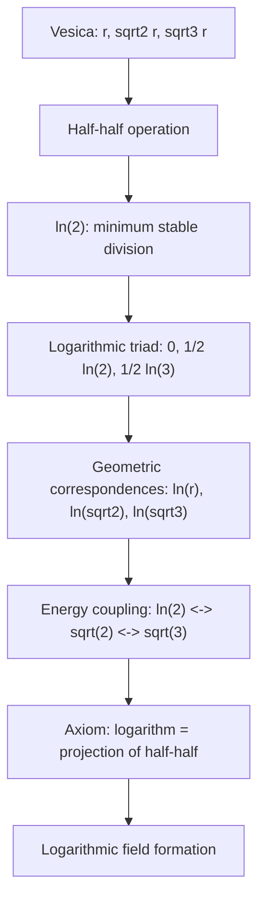

---

## **What We Render & Why**

Module 07 describes:

- why **ln(2)** is the Vesica’s logarithmic base operation
    
- how logarithms = projections of **half–half**
    
- how the Vesica’s three lines **r, √2r, √3r** create the logarithmic triad
    
- the connection **ln(2) ↔ √2 ↔ √3**
    
- how logarithms are the _rate of change of relation_, not numbers
    

The ASCII diagram visualizes:

- the Vesica’s three axes
    
- their logarithmic counterparts
    
- the relations between energy phases
    
- how logarithms arise from geometric division
    

This is **the entire core logic of Module 07**.

---

## **ASCII — Module 07**

```text
RP9 — Module 07: Logarithmic Structure
=====================================

Vesica (r, sqrt(2)r, sqrt(3)r)
  ↓
Half–half operation
  ↓
ln(2) (minimum stable division)
  ↓
Logarithmic triad
  (0, 1/2 ln(2), 1/2 ln(3))
  ↓
Geometric connections
  r        → ln(r)
  sqrt(2)r → ln(sqrt(2))
  sqrt(3)r → ln(sqrt(3))
  ↓
Energetic structure
  ln(2) ↔ sqrt(2) ↔ sqrt(3)
  ↓
Axiom
  Logarithm = projection of half–half
  ↓
Logarithmic field formation
  Division → Proportion → Relation
  ↓
Stable logarithmic asymmetry
```

---

# **APPENDIX M.7 — Mermaid (Module 07)**

## **What We Render & Why**

The Mermaid graph shows:

- the logarithm’s _geometric origin_
    
- the triad’s three levels
    
- the hidden coupling
    
- the RP9 axiom
    

All labels are enclosed in `"` for maximum stability in Obsidian.

---

## **Mermaid — Module 07**



---
---
---
---
