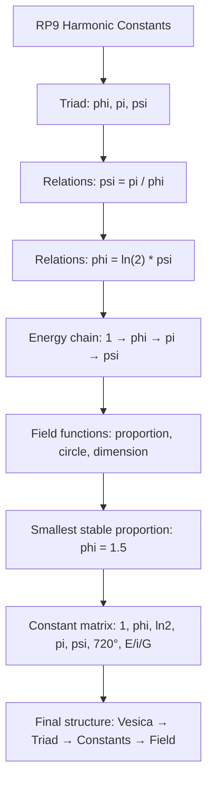

---

# **APPENDIX H.9 — ASCII (Module 09: Harmonic Constants)**

## **What We Render & Why**

Module 09 establishes:

- ψ–φ–π as RP9’s fundamental constant triad
    
- the internal energy chain (1 → φ → π → ψ)
    
- why 1.5 is the smallest stable proportion
    
- how the harmonic constants form a field
    
- RP9’s constant matrix
    
- the entire mathematical structure as _energy projections of the Vesica_
    

The ASCII diagram clarifies:

- the triad’s internal symmetry
    
- how the constants are interconnected
    
- why φ, π, and ψ are not numbers but field functions
    
- how the energy chain produces geometry
    
- how the constant matrix structures RP9’s field
    

---

## **ASCII — Module 09**

```text
RP9 — Module 09: Harmonic Constants
======================================

Fundamental triad:
    (phi, pi, psi)

Relations:
    psi = pi / phi
    phi = ln(2) * psi

Energy chain:
    1 → phi → pi → psi
      linear   circle   dimension

Field functions:
    phi = proportional energy
    pi  = circular energy
    psi = dimensional energy

Smallest stable deviation:
    phi = 1.5
      → stable proportion
      → spiral-compatible
      → recursion-capable

Constant matrix:
    1        = linear energy
    phi      = proportion
    ln(2)    = half–half axis
    pi       = circular energy
    psi      = dimensional motor
    720°     = full rotational phase
    E/i/G    = expansion field

Overall structure:
    Vesica → Triad → harmonic constants → field → recursion
```

---

# **APPENDIX M.9 — Mermaid (Module 09)**

## **What We Render & Why**

Stacked sequence:

- triad
    
- relations
    
- energy chain
    
- field functions
    
- structure of the constant matrix
    

All text is enclosed in `"` so that Obsidian reliably renders everything correctly.

---

## **Mermaid — Module 09**



---
---
---
---
