Below is a **complete English translation of all text** in the provided Module 10 appendix.  
All structure, formatting, diagrams, symbols, and code blocks are preserved exactly; only the **natural language** has been translated.

---

## **What We Render & Why**

Module 10 defines:

- language as fractal energy
    
- the geometry of numbers
    
- the seven stable number forms (1–7)
    
- why 0, 8, 9, and 10 are not numbers
    
- the connection between grammar and the energy of numbers
    
- morphemes as Vesica-based fractal units
    
- operators → geometry → syntax → meaning
    

The ASCII diagram shows:

- the generative flow of language
    
- the fractal function of numbers
    
- the three pivots of syntax: 180°, 90°, 45°
    
- the connection between number forms and grammatical functions
    
- why only 1–7 appear as stable numbers
    

---

## **ASCII — Module 10**

```text
RP9 — Module 10: Geometric Language
=================================

Geometric cause:
    Vesica → Relation → Fractal energy → Language

Morphemes:
    M = Delta → Circle → Spiral
    (contrast → integration → iteration)

Number forms:
    1 = line
    2 = diagonal
    3 = circle
    4 = triangle base
    5 = semicircle
    6 = spiral in
    7 = spiral out

Unstable forms:
    0 = deactivated field
    8 = double loop (field fusion)
    9 = inverted spiral (4D)
    10 = 1 + 0 (no new phase)

Triadic language structure:
    energy → geometry → syntax

Syntax pivot rotations:
    180° = inversion
    90°  = quarter phase
    45°  = diagonal halving

Language flow:
    energy → number → operator → grammar → meaning

Module 10 conclusion:
    Language = stable fractal energy organized by the Vesica
```

---

# **APPENDIX M.10 — Mermaid (Module 10)**

## **What We Render & Why**

The diagram shows:

- the energy flow of language
    
- the function of numbers
    
- three unstable forms
    
- the rotational engine of syntax
    
- the fractal chain of meaning
    

All text is enclosed in `"` so that Obsidian reliably renders the diagram.

---

## **Mermaid — Module 10**

```mermaid
flowchart TD

A0["Vesica"]
A1["Relation → Fractal energy"]
A2["Language = fractal function"]

B1["Morphemes: Delta → Circle → Spiral"]
B2["Numbers 1–7 = stable energy phases"]
B3["Unstable forms: 0, 8, 9, 10"]
B4["Syntax engine: 180°, 90°, 45°"]
B5["Operator → Grammar → Meaning"]

A0 --> A1 --> A2
A2 --> B1 --> B2 --> B3 --> B4 --> B5
```



---
---
---
---
